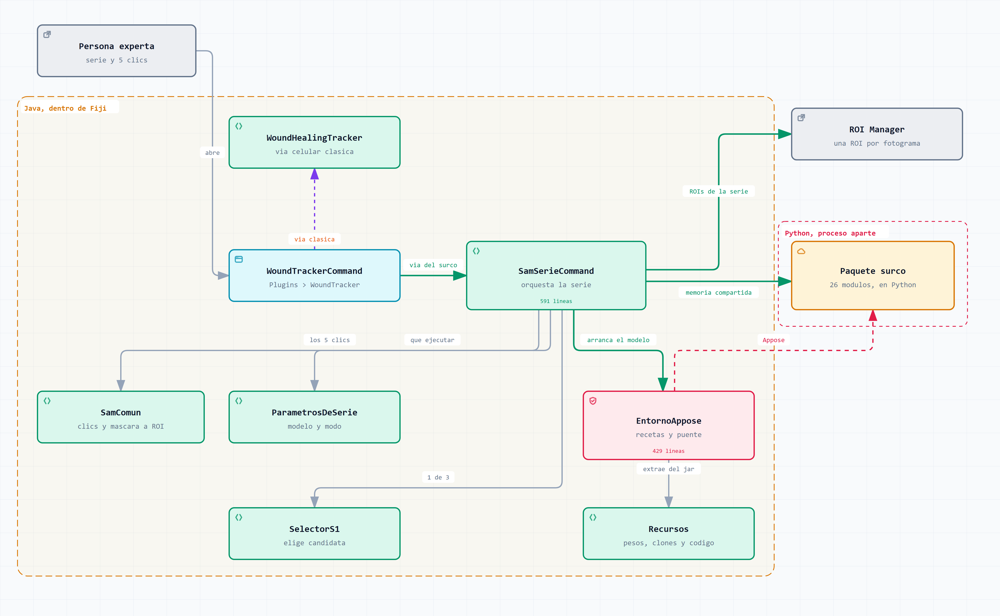

# woundtracker-sam

Un plugin de Fiji que segmenta el surco de microirradiación a lo largo de una serie temporal
a partir de cinco clics, y el banco de pruebas con el que se eligió qué modelo lleva dentro.

El plugin está en la raíz. El banco, en `banco/`, con su propio README.

## Qué hace el plugin

En Fiji, `Plugins > WoundTracker`. Ofrece dos vías: la segmentación celular clásica por
umbral y la del surco, que es la de este trabajo.

En la del surco se elige modelo y *checkpoint* del catálogo, se elige modo temporal y se
marcan cinco clics sobre el fotograma semilla: tres sobre el surco y dos en el nucleoplasma
de alrededor. A partir de ahí el plugin recorre la serie entera y deja las ROIs en el
*ROI Manager*, que es donde el laboratorio las espera.

### El catálogo

Cinco entradas, una por familia del estudio:

    microsam_lm   microscopía (fluorescencia)   vit_b, vit_t, vit_l
    sam21         linaje SAM 2.1                large, tiny, small, base_plus
    tinysam       eficiencia                    vit_t
    sammed2d      radiología                    sam_med2d
    sato          clásico (filtro de cresta)    sin pesos

Nueve combinaciones de modelo y *checkpoint* con pesos, más Sato.

### Los modos temporales

- **M1**, los mismos clics en cada fotograma.
- **M4**, encadenado: la máscara de un fotograma entra como pista en el siguiente.
- **M3**, propagación de vídeo. Solo con `sam21`, el único del catálogo con banco de memoria.
- Y segmentar solo el fotograma marcado, sin recorrer la serie.

El desplegable ofrece únicamente los modos que el modelo admite.

### Compilar

    mvn package

Java 8 y `pom-scijava` 37.0.0. El `.jar` que sale va a la carpeta `plugins/` de Fiji.

### La primera vez cuesta

El plugin construye por su cuenta el entorno de Python de cada modelo, con `pixi`, y descarga
los pesos. **Son varios GB por modelo y hace falta red.** Las siguientes ejecuciones
reutilizan el entorno en caché y solo pagan la carga del modelo y la inferencia.

**TinySAM necesita GPU.** Su *checkpoint* se deserializa sobre CUDA y el registro del
repositorio que la receta clona no admite indicar el dispositivo, así que en un equipo sin
GPU compatible ese modelo no arranca. Las otras cuatro entradas del catálogo sí.

## El banco de pruebas

Es lo que decidió qué va dentro del plugin: **14 métodos medidos sobre 17 lesiones**, con
Dice e intervalos por *bootstrap*, cruzando modelo, modo temporal, protocolo de clics y
selector de máscaras.

**Empieza por `banco/notebooks/GUIA.ipynb`**, que es el índice ejecutable: fase a fase,
qué hace, qué scripts ejecuta, en qué entorno y qué ficheros deja. Lo demás está en
`banco/README.md`.
